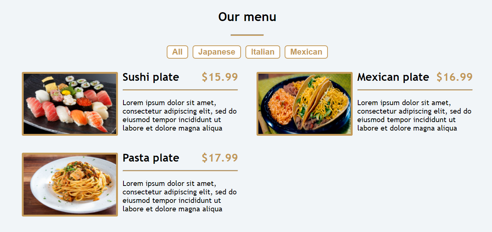

<h1 Align="center">
Restaurant menu page</h1>

## 💻 Project

in this project i developed a Restaurant menu page with sections of each country's food 

## 📐 Layout

## 🚀 Techs

- HTML
- CSS
- JavaScript

## ⚙️ Key concepts

- Arrays
- Objects
- ForEach()
- DOMContentLoaded
- map, reduce and filter
- includes method
---
Made with 💚 by João Yasuda 👋🏼 [See my Linkedin](https://www.linkedin.com/in/jo%C3%A3o-victor-yasuda-668679214/)